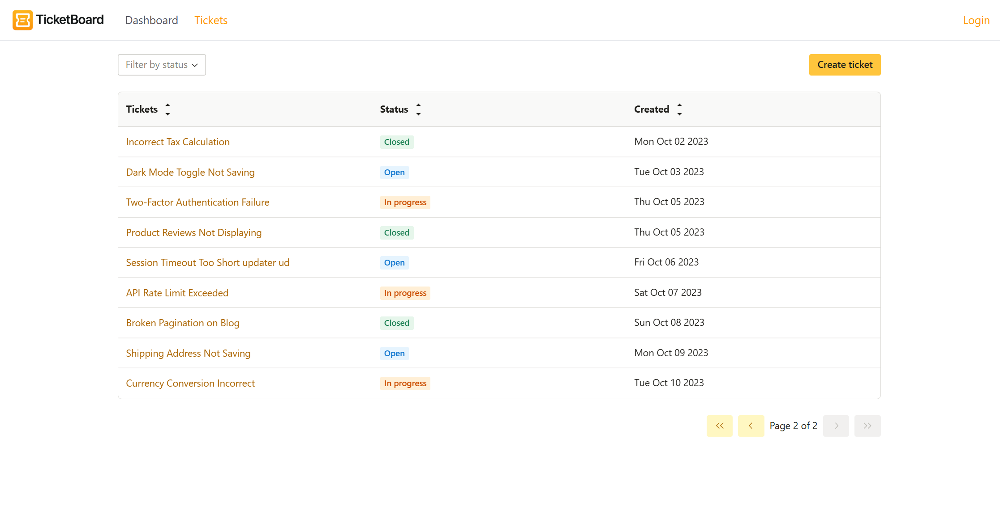

# 🎟️ Ticket Board

**Ticket Board** is a straightforward web app to manage tickets (bugs): create, view, update, and delete items with optional filtering and sorting. It’s built with modern React tooling (Next.js 15 + React 19), typed with TypeScript, and backed by PostgreSQL via Prisma.

---

## 🚀 Tech Stack

* **Framework & UI**: Next.js 15 (App Router, Turbopack), React 19, TypeScript 5, Tailwind CSS 4, Radix UI (themes & icons)
* **Forms & Validation**: React Hook Form, Zod, @hookform/resolvers
* **Data & API**: TanStack React Query v5, Axios
* **Auth**: NextAuth.js (with `@next-auth/prisma-adapter`)
* **Database**: PostgreSQL (e.g., Supabase) with Prisma 6
* **Content & UX**: SimpleMDE (`react-simplemde-editor` / `easymde`), React Markdown, Recharts, react-hot-toast, react-loading-skeleton
* **Tooling**: ESLint 9, Tailwind Typography plugin

> ℹ️ Note: Ensure `@prisma/client` is installed as a **runtime dependency** (in `dependencies`) for production/serverless deployments.

---

## 🔗 Live Demo & Screenshots

Live App: https://tickets-board.vercel.app/

---

## ✨ Features

* ➕ **Create** tickets (title, description/markdown, status)
* 👀 **View** tickets list with loading skeletons
* ✏️ **Edit** ticket details with form validation (RHF + Zod)
* ❌ **Delete** tickets
* 🔎 **Filter/Sort** tickets by name, status or creation date
* ⏱️ **Real‑time‑like UX** with React Query (instant updates, cache, optimistic patterns)
* 📝 **Markdown** support for descriptions (SimpleMDE + React Markdown)
* 📊 **Charts/Dashboards** with Recharts
* 🔔 **Toasts** for feedback and errors
* 🌓 **Accessible UI** with Radix + Tailwind

---

## 📸 Screenshots

